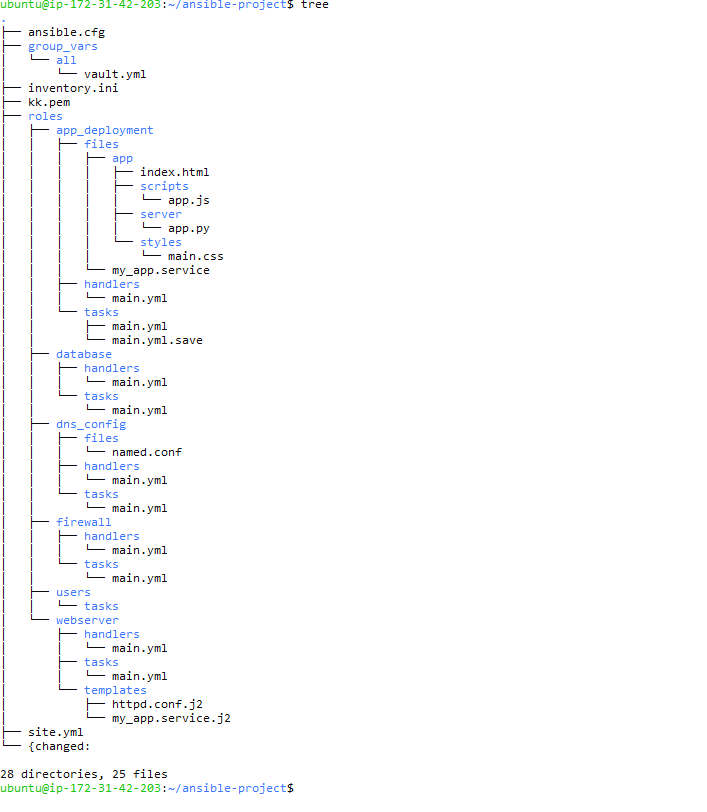
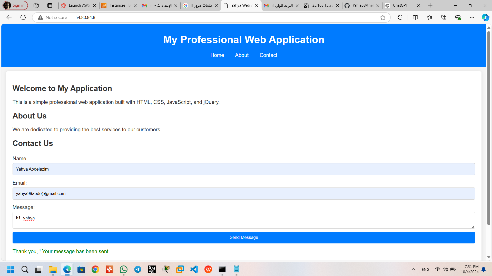
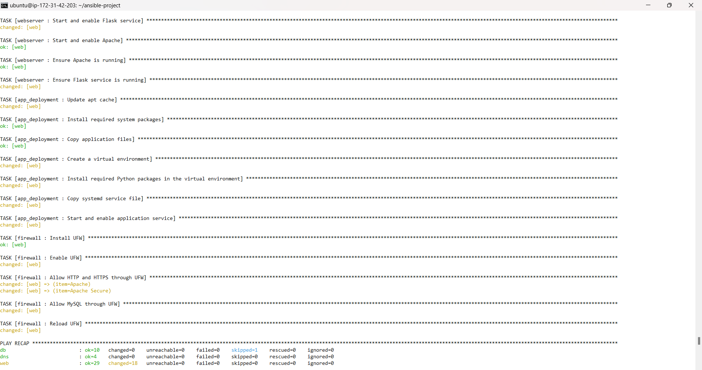

# Project Description: Ansible Application Deployment
## Overview
This project is an automated deployment solution for a web application built using Flask. It leverages Ansible to provision the necessary infrastructure, configure web and database services, and deploy application files seamlessly across target servers. The automation enhances efficiency, reduces manual errors, and ensures consistency across environments.
## Project Structure

## the Ansible concepts that i use in this project:
### Introduction to Ansible
### Installation and Configuration
### Inventory Management
### Understanding and Executing Playbooks
### Creating and Using Roles
### Exploring Ansible Modules
### Working with Variables and Facts
### Utilizing Handlers in Ansible
### Creating Templates with Jinja2
### Error Handling and Debugging Techniques

## Key Features
   ### Automated Application Deployment:

Utilizes Ansible playbooks to automate the installation and configuration of the Flask application on the target server(s).
Deploys application files, including HTML, JavaScript, CSS, and Python scripts.
   ### Web Server Configuration:

Configures an HTTP server (such as Apache or Nginx) to serve the web application.
Manages server settings through Jinja2 templates for flexibility and reusability.
### Service Management:

Creates a systemd service to ensure the Flask application runs as a background service, automatically starting on boot.
Allows easy management of the application service through standard systemd commands.
### Email Notifications:

Implements a contact form that allows users to submit their name, email, and message.
Sends email notifications to a specified email address using an SMTP server whenever a new message is received.
### Database Setup:

Configures database services (if applicable) to support the application, enabling data persistence and storage.
### DNS Configuration:

Optionally manages DNS settings to ensure the application is accessible via a domain name.
### Firewall Configuration:

Sets up firewall rules to secure the application by allowing only necessary traffic.
Technology Stack
Infrastructure: Ansible for configuration management and automation.
Web Framework: Flask for building the web application.
Web Server: Apache or Nginx (configured via Ansible).
Database: Can be configured as per application requirements (e.g., MySQL, PostgreSQL).
Email Sending: Utilizes Python's smtplib to send emails via an SMTP server (e.g., Gmail).
Templates: Jinja2 templates for dynamic configuration file generation.
## Project Structure
The project is organized into roles, each serving a specific purpose in the deployment process. This modular structure promotes reusability and maintainability:

roles/app_deployment: Contains tasks, handlers, and files necessary for deploying the application.

files/app: Directory with application files (HTML, CSS, JS, Python).
handlers/main.yml: Handlers for tasks, such as restarting services after deployment.
tasks/main.yml: Main tasks to install packages, copy files, and set up services.
roles/database: Handles database configuration and management.

roles/dns_config: Manages DNS settings for the application.

roles/firewall: Configures firewall rules for security.

roles/users: Manages user accounts and permissions.

roles/webserver: Responsible for setting up and configuring the web server.

## Deployment Instructions
### Prerequisites:

Ensure Ansible is installed on your control machine.
Access to the target server(s) via SSH.
Proper configuration of SMTP settings for email notifications.
Setup:

## Images

### Image 1

### Image 2

 ## Execution:

Run the Ansible playbook to deploy the application with a single command, ensuring a streamlined setup process.
## Conclusion
This Ansible project provides a robust solution for deploying and managing a Flask web application, significantly reducing the complexity and time associated with traditional deployment methods. Its modular design, coupled with automation, ensures a consistent and reliable deployment process, enabling users to focus on developing and improving their applications.
